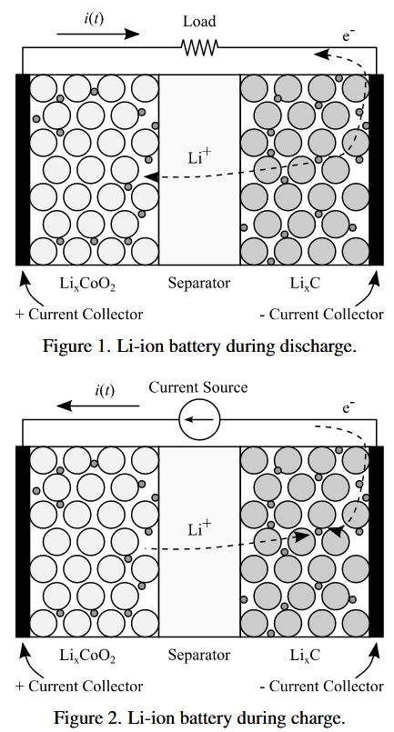
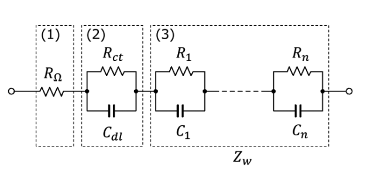

# <!-- fit --> :memo: Cellモデリングと拡張カルマンフィルタ(EKF)

<!-- _class: title -->

## はじめに

LIB(リチウムイオン二次電池)のモデリングアプローチとして，以下に分類できると認識している．
1. 等価回路によるモデル(非線形状態方程式/非線形微分方程式)近似
2. 電気化学による第一原理モデル(偏微分方程式)
3. ふるまいモデル(ブラックスボックスモデル)

次に，SOC，SOHなどの内部状態の推定の方法は，一般的には等価回路モデルによる非線形状態方程式を対象に拡張カルマンフィルタ(EKF)もしくは無香料カルマンフィルタ(UKF)などを用いて行われることが多い．
同様に非線形状態方程式を用いて，DeepRL(深層強化学習)での制御アプローチも報告例がある．

<!--

## 構成について

-->

<!--

-->

<!--
- 電解液抵抗 $R_s$(充電/放電)
- 電荷移動抵抗 $R_{ct}$(充電/放電)
- 電気二重層容量 $C_{dl}$(充電/放電)
- 電荷移動抵抗 $R_{ct2}$(充電/放電)
- 電気二重層容量 $C_{dl2}$(充電/放電)
-->

## LIBの非線形性と理由

リチウムイオン二次電池のSOC-OCV 特性は下式のような非線形関数として示される．
$$OCV(t)=f_{ocv}(SOC(t))$$

1. 充電/放電のヒステリシス性(SOC-OCV特性が変化する)
    - 充放電に伴うリチウムイオンの拡散が落ち着くまでの時間($\tau_d$)の影響(数10分から数時間程度)
    - そもそも，最近の電池の特性としてSOC-OCVの関係がフラット気味になってきていると言われている．
2. OCV応答の時間的特性として，速い応答と遅い応答が含まれる
3. SOC/SOHによる内部パラメータの変動
4. セル温度による内部パラメータの変動

## 等価回路(フォスター型等価回路)

(1),(2),(3)は以下の様な現象特性と関連付けられている
- (1) 電解液内での泳動過程の抵抗 : 溶液抵抗$R_{sol}$，端子抵抗など
- (2) 電極表面の溶媒和・脱溶媒和過程のインピーダンス : 電気二重層容量$C_{dl}$，電荷移動抵抗$R_{ct}$
- (3) リチウムイオンの拡散過程のインピーダンス$Z_w$(ワールブルグインピーダンス)

## 等価回路パラメータのオフライン同定

パルス放電時のセル端子電圧応答から求める方法が

※ SOC,セル温度と$R_0$, $R_{df}$, $\tau_d$ は相関があるので，SOC，セル温度水準ごとに計測してLookUpテーブル等で参照することが望ましいと思われる．

## 等価回路のモデル化(非線形状態方程式)

拡散電圧$V_{df}$，

$$\begin{bmatrix}SOC_{k+1}\\V_{df,k+1}\end{bmatrix}=
\begin{bmatrix}1&0\\0&1-\frac{\Delta t}{C_{df}R_{df}}\end{bmatrix}\begin{bmatrix}SOC_{k}\\V_{df,k}\end{bmatrix}+\begin{bmatrix}-\frac{\Delta t}{C_{nom}}\\-\frac{\Delta t}{C_{df}}\end{bmatrix}I_{bat}$$

$$V_{bat} = OCV(SOC_k) − R_i I_{bat} − V_{df}$$

## 拡張カルマンフィルタ(EKF)の適応

### 前提

1. 論文や文献等ではパラメータのオフライン同定を前提としていることが多い．この場合は熱や劣化の影響を考慮しないことになる．
2. 同様に簡易的な事例として説明されているものは，KEFのモデル入力項を電流iのみとしていることが多い．推定したい項の要素数に対して，一つ少ない次元でも解けるので計算量は減るが推定精度は低下するものと思われる．
3. 観測ノイズおよび，

## 発展的な技術

パラメータをオフライン同定する場合の欠点を補うために，デュアルEKF(DKEF)を用いて，パラメータのオンライン推定と，状態量をそれぞれ推定する方法が提案されている．

## 参考文献