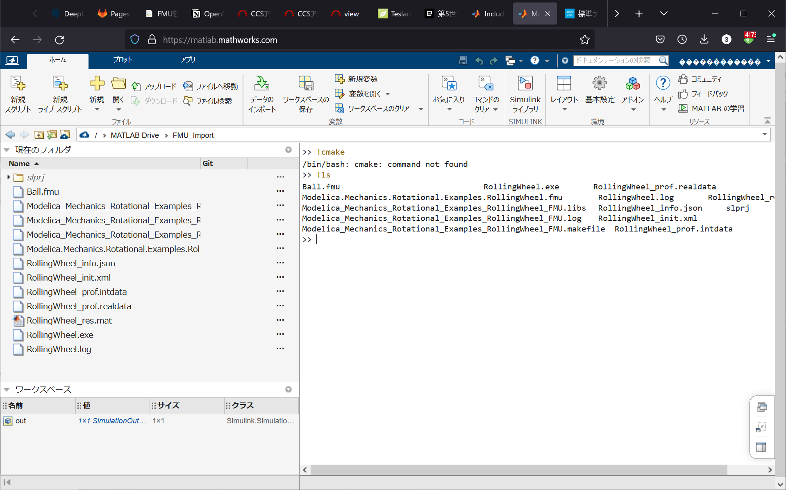

## Gitリポジトリからのクローン
Fileメニューから可能．
GitHubのリポジトリからクローンができることを確認している．  

 <aside>
💡 社内ローカルのGitサーバにあるリポジトリは外部からアクセスを許可していないのでクローン不可．ファイルでアップロードするか，外部のGitリポジトリを経由する必要あり．
</aside>

## Gitへのコミット
できない．

[Git on Matlab online](https://jp.mathworks.com/matlabcentral/answers/829363-git-on-matlab-online)

>現在、MATLAB Online では git 統合 / ソース管理統合はサポートされていません。この要望は関係者に伝えました。将来のリリースで実装されるかもしれません。

ということらしい

## 2022-03-11追記
いつの間にかGitの項目が!
→ 2022aになっていることが要因かと  

---

## スライド

<iframe src="slide.html"
            title="スライド表示" width="480" height="270">
</iframe>
