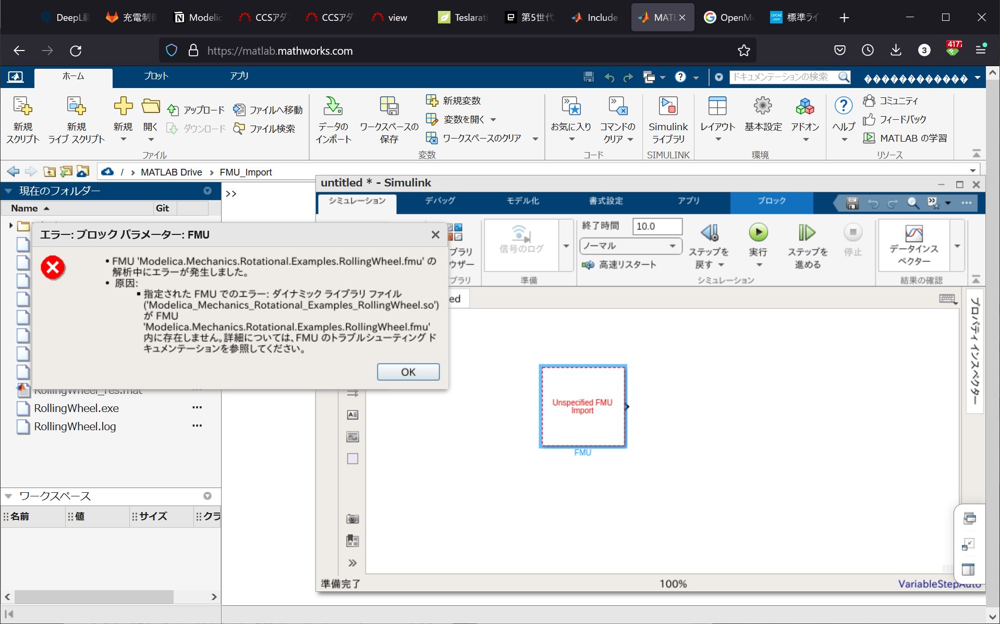
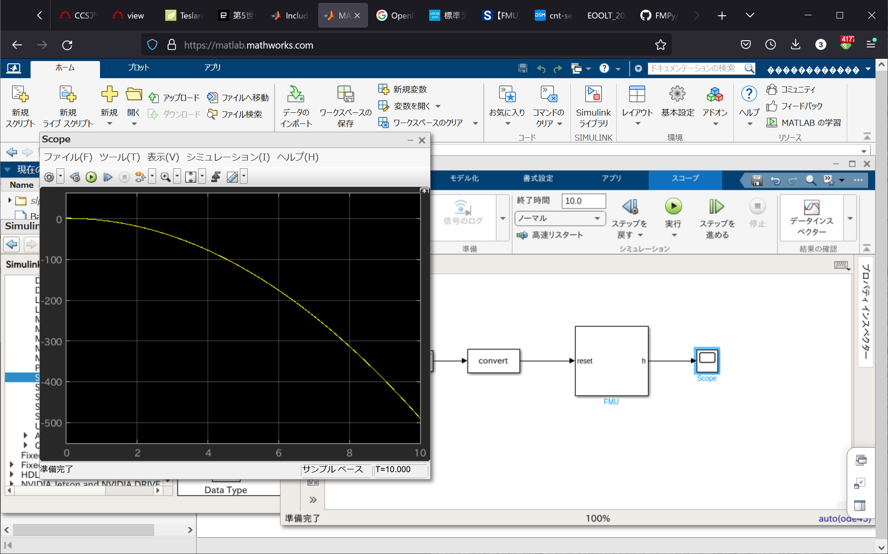

<!-- _class: title -->
# <!-- fit --> :memo:FunctionMockupUnitのインポート

## 目的とゴール

### 目的

- SimulinkでFMUを使う目的として，Simscapeの保有していないオプション(Drivetrain,Multi-body等)のモデルを扱う際に，Modelica等の既存のサンプルを利用することが有効であると考えるという事がひとつ．  
- 他に，Simscape等で作成したプラントモデルをFMUとしてExportすることで，Simulink以外のツールとの連携を利用して，例えば機械学習用の対象モデルとして活用を見込むというモチベーションがある．

### ゴール

- OpenModelicaでFMUをExportし，Simulinkに取り込んでシミュレーションを実行し結果を得ること．

## 作業履歴

### OpenModelicaからFMU作成

- Windows上でFMUを作成したので，MATLAB online(Linux)向けの実行ファイル(*.so)が生成されなかった？
- *.fmuをzipで開くとソースコードは含まれている．確かバイナリの種類ごとに格納するフォルダがあったはずなので，あとからバイナリを作成する方法を調べてみる
- コンパイルはホスト側で行われるのかも．Simulinkで実行できた[Ball.fmu](https://github.com/CATIA-Systems/FMPy)を見ると，`darwin64`, `linux64`, `win64`のバイナリが格納されていた．

## インポートしてSimulationできた

Ball.fmuをインポートしてシミュレーション
ExportしているModelicaツール不明，fmuを直接記述,コンパイルしている可能性あり．

## OpenModelicaでMATLABonline向けFMUをExport

### やったこと

1. Windows版でそのままExportすると，FMUのインポートとBuildは成功するがMATLAB onlineのVMインスタンスであるlinux64実行ファイル(バイナリ)が生成できずに実行を失敗する．
2. Windows版からクロスコンパイラ用にVMを立ててコンパイルする．OpenModelica側で対応中の機能のようで，開発最新ビルドが必要．
3. 最新ビルド(v1.19.1)でクロスコンパイラを呼び出すも失敗．確認はlinuxで行われているようでWindows側のコンテナ対応と整合していないかもしれない．
4. WindowsのWSLを使って，Ubuntu16.04を立てそこにlinux版OpenModelicaを入れて試してみる．GUIのX11の表示がクリアできず．
5. Windows版のコンテナでOpenModelicaを動かすも，Windows版でのDockerComposerの設定方法がわからない．
6. linuxサーバ上に仮想コンテナでOpenModelicaを構築，こちらではX-ServerでX11での実行できた．
7. OpenModelicaのv1.9.4でFMUをExportし，linux64バイナリ生成に成功．これをMATLAB onlineに持ってゆき実行を試みるが，Dynamic LinkでError．libモジュールのバージョンが合わないか．公式のOpenmodelicaのDockerHubだがどうやらコンテナのベースがCentOS？RedHat系．
---
8. OpenModelicaのv1.18.0で同じく確認．こちらはUbuntu/Debian系．今度はlibが新しすぎた．MATLAB onlineのUbuntuは18.04LTS．
9. v1.17.0に落とすも同じ．
10. v1.14.2でUbuntu18.04だったようで，一部のlibのリンクエラーは解消．
11. DynamicリンクでFMUをExportすると，OpenModelicaの/lib/x86_64-linux-gnu/libOpenModelicaRuntimeC.soが含まれず失敗．これらをMATLAB onlineのVMにライブラリインストールはパーミッションエラー．ちなみに同じLinuxのインスタンスでFMUをInportするとダイナミックリンクが成功するので実行できた．
12. Staticリンクで生成すると，共用ライブラリであるlibc.so.6でErr．
13. WSLでUbuntu 18.04LTSを入れ，OpenModelica v1.18.1を入れてFMU生成．おそらく，MATLABで実行まで行っているが実行でクラッシュする．

## Open Issue
[FMU export options "none", "dynamic", "static" are broken.#8168 ](https://github.com/OpenModelica/OpenModelica/issues/8168#)
> Dynamic and static seems to work. But we always need some static and dynamic libs, it is only different where the omc runtime libs are actually compiled to.
> platforms={"dynamic", "static"} doesn't make sense. We should issue a warning.
> And now we could do the same on Windows. And I bet it will be somewhat different. But not today any more.

> Then we have the option to cross compile, e.g. using Docker (works both from Windows and Linux). It's a cool feature but barely documented and I'm not 100% sure it actually works.

CVODE(ODE演算ライブラリ,libsundials_cvode.so.5])に依存する．これを静的にリンクすることは難しい，とのこと．

## 参考
1. [FMUのインポート](https://jp.mathworks.com/help/simulink/ug/work-with-fmi-in-simulink.html)
2. [FMUブロックの実装](https://jp.mathworks.com/help/simulink/ug/implement-an-fmi-block.html)

---

## スライド

<iframe src="slide.html"
            title="スライド表示" width="480" height="270">
</iframe>
