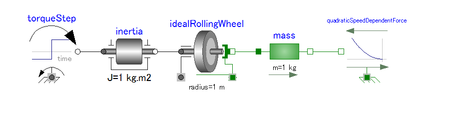
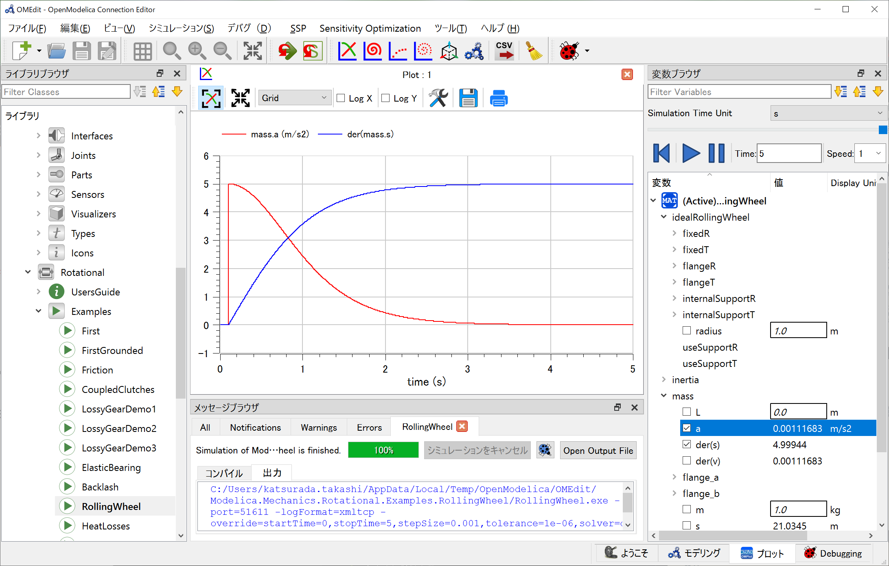
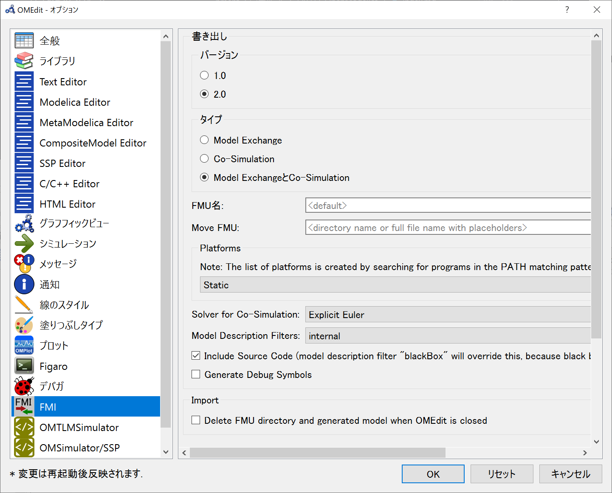
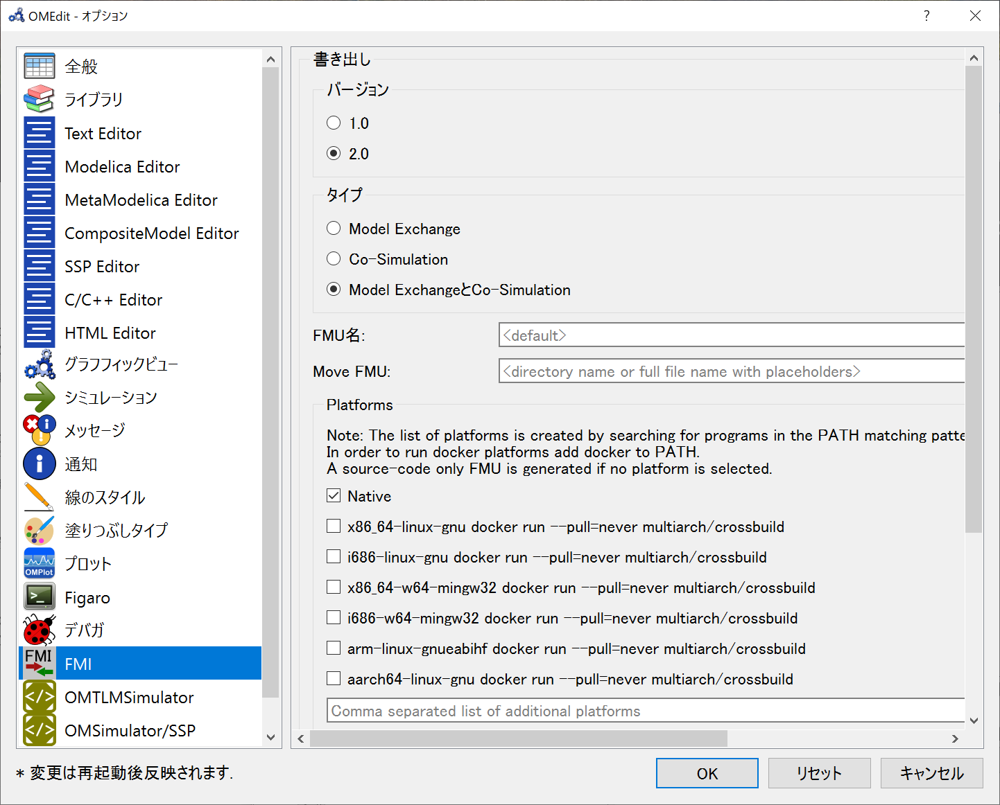

# OpenModelica
### 目的
- 非因果モデリング言語として一般的なModelica言語を使用する環境として，OSSでは[OpenModelica](https://www.openmodelica.org/)がある．他の選択肢として[JModelica](https://jmodelica.org//)があるが2019年から非公開プロジェクトになっている．  
- SimscapeはMathworksが管理する非因果モデリング言語なので，Simulink環境で使用する際に利便性が高い反面，ドメインごとにライセンスが別れており，保有していないドメインはモデリングが困難であることと，Simulink環境に制限されるという課題がある．(例えば，機械学習用のプラットフォームはPythonが多い)
- VectorのCANoe等もFMUをサポートしている
### ゴール

## 導入手順
1. Windows向けのBuildがあるので入手してインストール
   - 執筆時点のStableBuildからv1.18.1-64bitを選択
2. 起動時にロードするMSLライブラリのバージョン選択
    1. MSL v3.2.3を自動的にロードします。その後、MSL v3.2.3を使用する他のモデルやパッケージをロードしたり、それを使用する新しいものを開始することができます。MSL v4.0.0を使用するモデルまたはパッケージを開くと、エラーが発生します。MSL v4.0.0 に興味がなく、OpenModelica 1.16.x と同じ動作をさせたい場合は、このオプションを推奨します。
    2. MSL v4.0.0 を自動的にロードします。MSL v4.0.0 を使用する他のモデルやパッケージをロードしたり、それを使用する新しいモデルを開始したりすることができます。MSL v3.2.3 を使用するモデルまたはパッケージを開くと、エラーが発生します。このオプションは、MSL v4.0.0に依存する新しいライブラリのみを使用する場合に推奨されます。
    3. MSLをロードしない。モデルまたはライブラリを開くと、開いているライブラリのuses()アノテーションに基づいて、適切なバージョンのMSLが自動的にロードされます。このオプションは、MSL v3.2.3を使っているプロジェクトとMSL v4.0.0を使っているプロジェクトとで異なる作業を行う場合にお勧めします。また、Modelica標準ライブラリの開発者であり、OpenModelica用にカスタマイズしたプレインストールバージョンではなく、独自の変更バージョンをロードする場合にもお勧めします。

## モデリング
- MSLをロードしない設定としたので，`C:\Program Files\OpenModelica1.18.1-64bit\lib\omlibrary`からライブラリを選択する

- FMUへのExportはファイルメニューからFMUを選択

## FMI
FMIの設定を見直し

---
linux64のバイナリを出力させたい
- NightlyBuildであるv1.19.0に切り替え

## 参考
1. [OpenModelica](https://www.openmodelica.org/23-news/224-december-23-2021-openmodelica-1-18-1)
2. [GitHub](https://github.com/OpenModelica/OpenModelica)
