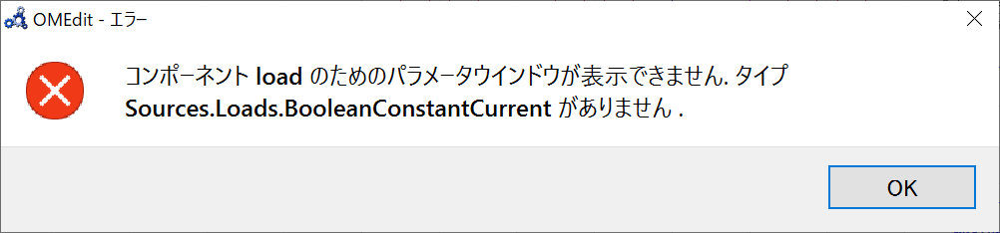
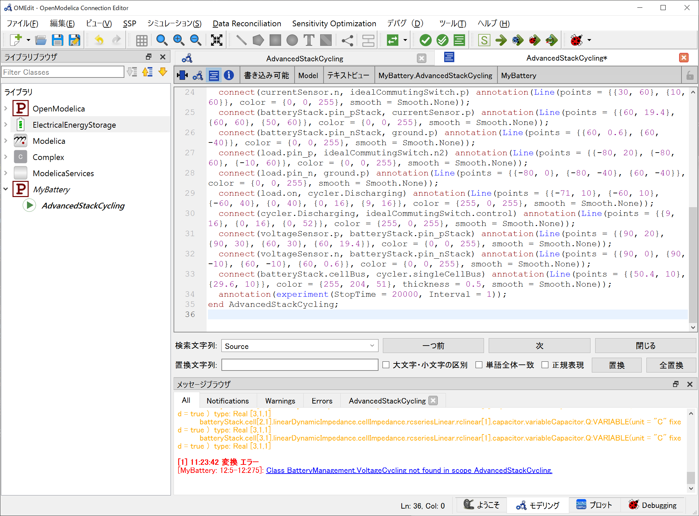
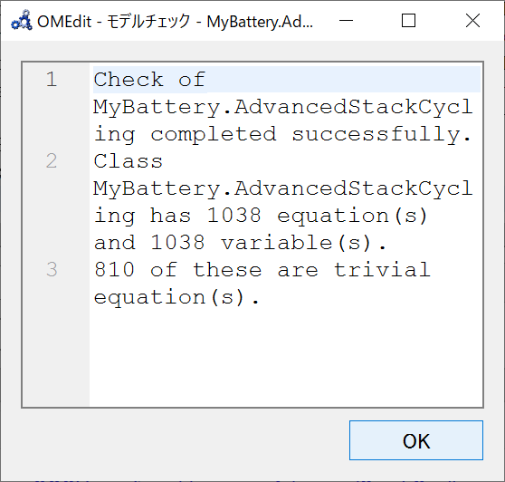

# <!-- fit --> :memo: Modelicaのサンプルモデルを使ってみるための手順
<!-- _class: title -->

## 概要

- バッテリセルシミュレーションモデルを取得し，サンプルからパラメータを変更してシミュレーション実行できるところまでを試す．
- ひとまずのゴールは，モード運転の車両シミュレーションモデルのバッテリ部分を入れ替えて，モード運転を動作させるところまで．
- 依存するMSL(ModelicaStandardLibrary)のバージョンがそれぞれ[MSL3.2.3]()，[MSL4.0.0]()だと思うのでその部分の吸収が必要なことが想定される．

## 追加のライブラリをインストール

- [Modelica](https://modelica.org/)の[3rd-party-library](https://modelica.org/libraries.html)である ***ElectricalEnergyStorage***を例として試す．
- ライブラリのインストールはGithubからClone(Linuxの場合)
- ライブラリをロードする

## ライブラリのサンプルモデル動作確認

## サンプルモデルを編集

### ライブラリのパス修正

サンプルモデルを複製したものを実行するとErrorとなる


モデルチェックを行うと，パスNG箇所がErrorとして出力されるので，すべて修正する

Modelicaファイルのライブラリパスが相対指定であるため`Sources.Loads.BooleanConstantCurrent load(I = 40)`が複製したことでリンク切れとなるので，以下の様に修正する `ElectricalEnergyStorage.Sources.Loads.BooleanConstantCurrent load(I = 40)`



## パラメータ変更

```c
BatteryManagement.VoltageCycling cycler(
    delayAfterDischarging = 100, 
    Vmax = 4.2, 
    delayAfterCharging = 500, 
    Ifinal = 2, 
    Vmin = 2.7, 
    initialDischarging = false, 
    ns = batteryStack.ns, 
    np = batteryStack.np
    ) annotation(Placement(transformation(extent = {{30, 0}, {10, 20}})));
```
