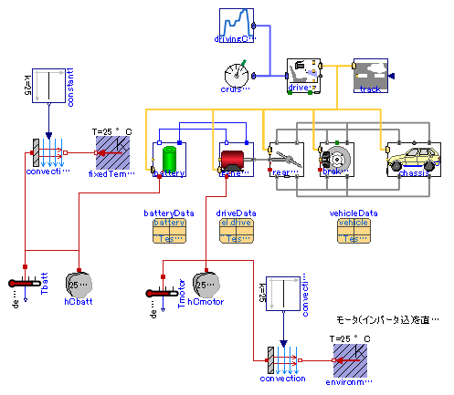
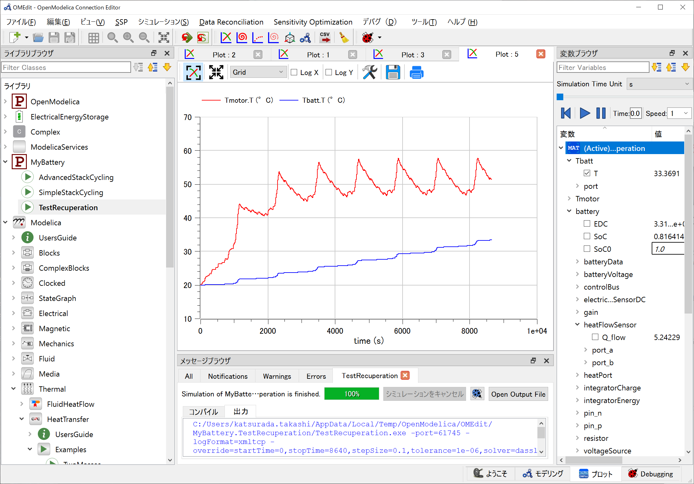
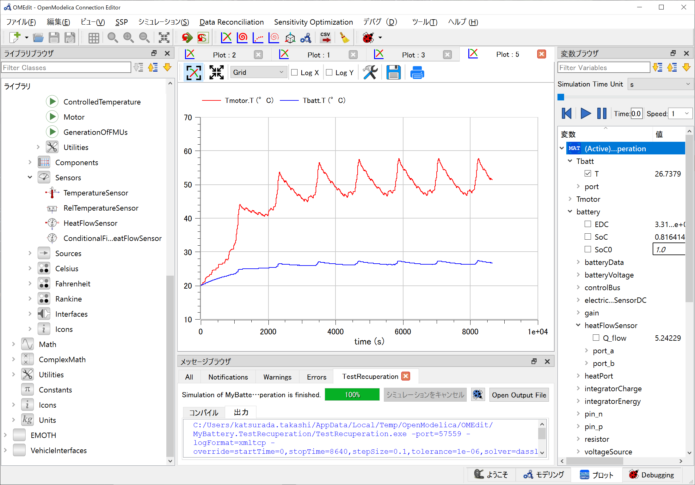
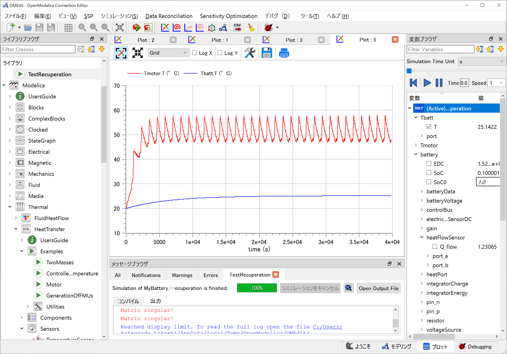
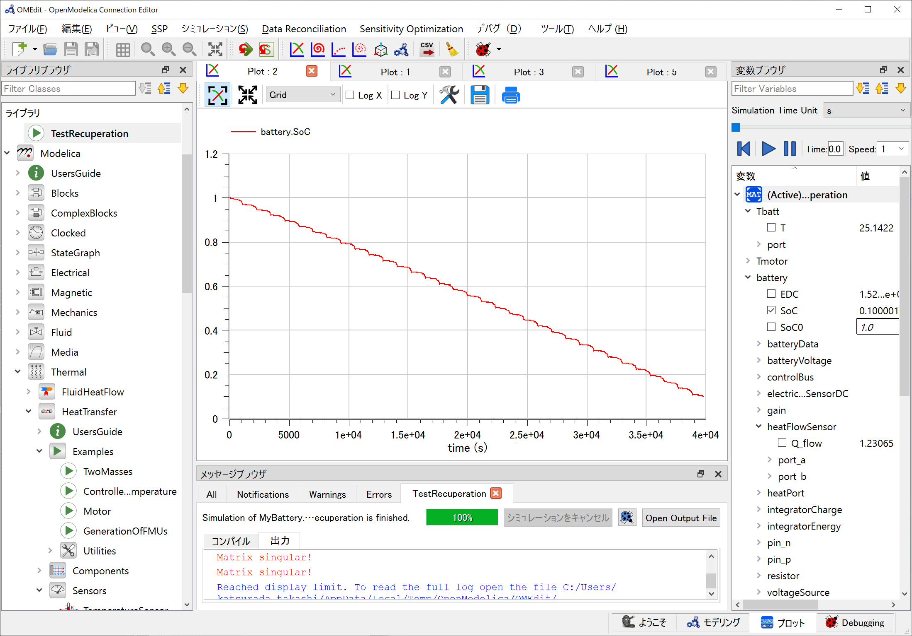

<!-- _class: title -->
# <!-- fit --> :memo:車両の1DシミュレーションをModelicaで動かしてみる

## 概要

## モータとバッテリの熱量と温度

- NEDCサイクルでパターン運転する電動車両コンポーネントから損失による熱量を熱容量に接続して温度をプロットする

- モータモデルの方には雰囲気温度(25[degC]固定)への熱交換(放熱)を付加しているので，NEDCサイクルごとに温度は上昇，降下を繰り返しサチュレーションする様子が見て取れる．
対して，バッテリ側は冷却モデルを構築していないので温度が上昇し続ける．

- バッテリ側にも冷却を加えたのが下図となる

## バッテリ容量を使い切るサイクル

- バッテリの熱容量を搭載容量相当の18650の重量相当で設定した．熱容量が大きいため，熱量に対する変動が小さい．
- 駆動コンポーネント(モータ/インバータ)温度は定常状態となっている．

- サイクル終了後，SOCは100[%]から10[%]に

## モデル概略

熱モデルと冷却を加えた状態

